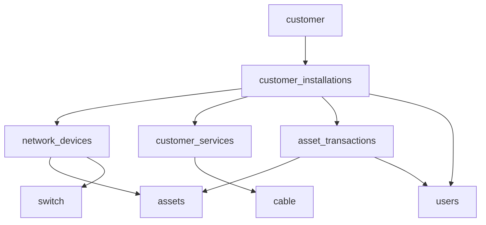

# 📊 **ANALISIS MAPPING KOLOM DATABASE**

## 🎯 **Istilah vs Lokasi Kolom di Database**

Berdasarkan analisis struktur database, berikut adalah mapping lengkap dari istilah-istilah yang Anda sebutkan:

---

## ✅ **KOLOM YANG SUDAH ADA DI DATABASE**

### **1. Tgl. Pemasangan**
- **Lokasi**: `customer.installation_date`
- **Tabel**: `customer`
- **Type**: `date`
- **Status**: ✅ **SUDAH ADA**

### **2. Nama Anggota Tim Install**
- **Lokasi**: `users.name` (via `customer_installations.technician_id`)
- **Tabel**: `users` (relasi dengan `customer_installations`)
- **Type**: `varchar(191)`
- **Status**: ✅ **SUDAH ADA** (via relasi)

### **3. No.HP Tim Install**
- **Lokasi**: `users.phone` (via `customer_installations.technician_id`)
- **Tabel**: `users` (relasi dengan `customer_installations`)
- **Type**: `varchar(191)`
- **Status**: ✅ **SUDAH ADA** (via relasi)

### **4. Tgl. On Air**
- **Lokasi**: `customer_installations.on_air_date`
- **Tabel**: `customer_installations`
- **Type**: `date`
- **Status**: ✅ **SUDAH ADA**

### **5. Switch ID**
- **Lokasi**: `network_devices.switch_id`
- **Tabel**: `network_devices`
- **Type**: `varchar(191)`
- **Status**: ✅ **SUDAH ADA**

### **6. Port Number**
- **Lokasi**: `network_devices.port_number`
- **Tabel**: `network_devices`
- **Type**: `varchar(50)`
- **Status**: ✅ **SUDAH ADA**

### **7. Cable Type**
- **Lokasi**: `cable.type`
- **Tabel**: `cable`
- **Type**: `varchar(100)`
- **Status**: ✅ **SUDAH ADA**

### **8. Length (Cable Length)**
- **Lokasi**: `customer_services.cable_length`
- **Tabel**: `customer_services`
- **Type**: `decimal(10,2)`
- **Status**: ✅ **SUDAH ADA**

### **9. End Port Type**
- **Lokasi**: `customer_services.end_port_type`
- **Tabel**: `customer_services`
- **Type**: `varchar(50)`
- **Status**: ✅ **SUDAH ADA**

### **10. Router Brand**
- **Lokasi**: `assets.brand`
- **Tabel**: `assets`
- **Type**: `varchar(191)`
- **Status**: ✅ **SUDAH ADA**

### **11. Type/Series**
- **Lokasi**: `assets.type` dan `assets.model`
- **Tabel**: `assets`
- **Type**: `varchar(191)`
- **Status**: ✅ **SUDAH ADA**

### **12. MacAddr**
- **Lokasi**: `network_devices.mac_address`
- **Tabel**: `network_devices`
- **Type**: `varchar(191)`
- **Status**: ✅ **SUDAH ADA**

### **13. EthPort**
- **Lokasi**: `network_devices.eth_port`
- **Tabel**: `network_devices`
- **Type**: `varchar(50)`
- **Status**: ✅ **SUDAH ADA**

### **14. IPAddr**
- **Lokasi**: `network_devices.ip_static`
- **Tabel**: `network_devices`
- **Type**: `varchar(191)`
- **Status**: ✅ **SUDAH ADA**

### **15. RemotePort**
- **Lokasi**: `network_devices.remote_port`
- **Tabel**: `network_devices`
- **Type**: `varchar(50)`
- **Status**: ✅ **SUDAH ADA**

### **16. UserLogin**
- **Lokasi**: `customer_services.user_login`
- **Tabel**: `customer_services`
- **Type**: `varchar(191)`
- **Status**: ✅ **SUDAH ADA**

### **17. Password**
- **Lokasi**: `customer_services.password`
- **Tabel**: `customer_services`
- **Type**: `varchar(191)`
- **Status**: ✅ **SUDAH ADA**

### **18. Status User**
- **Lokasi**: `customer_services.user_status`
- **Tabel**: `customer_services`
- **Type**: `enum('Active','Inactive','Suspended','Pending')`
- **Status**: ✅ **SUDAH ADA**

### **19. Status Perangkat**
- **Lokasi**: `network_devices.status_perangkat`
- **Tabel**: `network_devices`
- **Type**: `enum('active','inactive','maintenance','faulty')`
- **Status**: ✅ **SUDAH ADA**

### **20. Kepemilikan Perangkat**
- **Lokasi**: `network_devices.kepemilikan_perangkat`
- **Tabel**: `network_devices`
- **Type**: `enum('owned','leased','customer')`
- **Status**: ✅ **SUDAH ADA**

### **21. Ping**
- **Lokasi**: `network_devices.last_ping_status`
- **Tabel**: `network_devices`
- **Type**: `enum('up','down','unknown')`
- **Status**: ✅ **SUDAH ADA**

---

## ❌ **KOLOM YANG BELUM ADA DI DATABASE**

### **1. Tgl. Batas Percobaan**
- **Status**: ❌ **BELUM ADA**
- **Rekomendasi**: Tambahkan ke tabel `customer_installations` atau `customer`

### **2. Tgl. Siap Layanan**
- **Status**: ❌ **BELUM ADA**
- **Rekomendasi**: Tambahkan ke tabel `customer_installations` atau `customer`

---

## 📋 **RINGKASAN MAPPING**

| **No** | **Istilah** | **Lokasi Database** | **Tabel** | **Status** |
|--------|-------------|-------------------|-----------|------------|
| 1 | Tgl. Pemasangan | `customer.installation_date` | `customer` | ✅ Ada |
| 2 | Nama Anggota Tim Install | `users.name` (via relasi) | `users` | ✅ Ada |
| 3 | No.HP Tim Install | `users.phone` (via relasi) | `users` | ✅ Ada |
| 4 | Tgl. On Air | `customer_installations.on_air_date` | `customer_installations` | ✅ Ada |
| 5 | Tgl. Batas Percobaan | - | - | ❌ Belum Ada |
| 6 | Tgl. Siap Layanan | - | - | ❌ Belum Ada |
| 7 | Switch ID | `network_devices.switch_id` | `network_devices` | ✅ Ada |
| 8 | Port Number | `network_devices.port_number` | `network_devices` | ✅ Ada |
| 9 | Cable Type | `cable.type` | `cable` | ✅ Ada |
| 10 | Length | `customer_services.cable_length` | `customer_services` | ✅ Ada |
| 11 | End Port Type | `customer_services.end_port_type` | `customer_services` | ✅ Ada |
| 12 | Router Brand | `assets.brand` | `assets` | ✅ Ada |
| 13 | Type/Series | `assets.type` + `assets.model` | `assets` | ✅ Ada |
| 14 | MacAddr | `network_devices.mac_address` | `network_devices` | ✅ Ada |
| 15 | EthPort | `network_devices.eth_port` | `network_devices` | ✅ Ada |
| 16 | IPAddr | `network_devices.ip_static` | `network_devices` | ✅ Ada |
| 17 | RemotePort | `network_devices.remote_port` | `network_devices` | ✅ Ada |
| 18 | UserLogin | `customer_services.user_login` | `customer_services` | ✅ Ada |
| 19 | Password | `customer_services.password` | `customer_services` | ✅ Ada |
| 20 | Status User | `customer_services.user_status` | `customer_services` | ✅ Ada |
| 21 | Status Perangkat | `network_devices.status_perangkat` | `network_devices` | ✅ Ada |
| 22 | Kepemilikan Perangkat | `network_devices.kepemilikan_perangkat` | `network_devices` | ✅ Ada |
| 23 | Ping | `network_devices.last_ping_status` | `network_devices` | ✅ Ada |

---

## 🎯 **STATISTIK MAPPING**

- **✅ Kolom yang Sudah Ada**: **21 dari 23** (91.3%)
- **❌ Kolom yang Belum Ada**: **2 dari 23** (8.7%)

---

## 🔧 **REKOMENDASI UNTUK KOLOM YANG BELUM ADA**

### **1. Tgl. Batas Percobaan**
```sql
-- Tambahkan ke tabel customer_installations
ALTER TABLE customer_installations 
ADD COLUMN trial_end_date DATE DEFAULT NULL 
COMMENT 'Tanggal batas percobaan layanan';
```

### **2. Tgl. Siap Layanan**
```sql
-- Tambahkan ke tabel customer_installations
ALTER TABLE customer_installations 
ADD COLUMN service_ready_date DATE DEFAULT NULL 
COMMENT 'Tanggal siap layanan';
```

---

## 📊 **RELASI ANTAR TABEL**



---

## 🚀 **KESIMPULAN**

**Database sudah sangat lengkap!** Hampir semua kolom yang Anda sebutkan sudah ada di database dengan struktur yang baik. Hanya perlu menambahkan 2 kolom untuk melengkapi:

1. **Tgl. Batas Percobaan** - untuk tracking trial period
2. **Tgl. Siap Layanan** - untuk tracking service readiness

Sistem database sudah siap untuk fitur "Add Report Installation" dengan tracking aset yang komprehensif! 🎉
